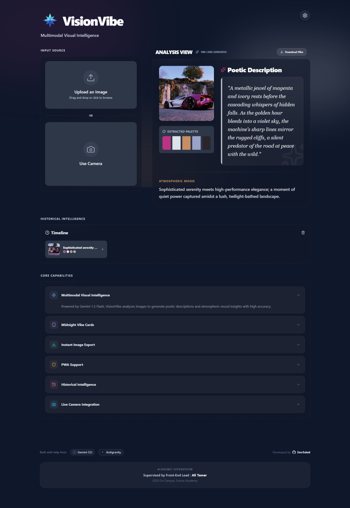

#  VisionVibe: Multimodal Visual Intelligence

VisionVibe is a cutting-edge web application that blends artificial intelligence with artistic expression. Powered by Google's Gemini 1.5 Flash, it transforms your images and live camera captures into immersive "Midnight" vibe cards, complete with poetic descriptions, atmospheric mood analysis, and dynamically extracted color palettes.



## ✨ Features

- **🧠 Multimodal AI Analysis**: Leverages Gemini 1.5 Flash to understand the deep visual essence of any image.
- **🌑 Midnight Aesthetic**: A high-contrast, immersive dark-mode interface designed for focus and impact.
- **🎨 Dynamic Palettes**: Automatically extracts and displays the dominant colors of your visuals.
- **📸 Live Capture**: Seamlessly integrate your device camera for real-time vibe generation.
- **💾 Historical Intelligence**: Local persistence ensures your visual journey is saved and accessible anytime.
- **📥 Instant Export**: Download your vibes as beautifully formatted PNG cards.
- **📱 Progressive Web App (PWA)**: Installable on mobile and desktop for a native, lightning-fast experience.

## 🚀 Tech Stack

- **Frontend**: React 19, TypeScript, Vite
- **Styling**: Tailwind CSS 4, Lucide Icons
- **AI Engine**: Google Generative AI (@google/generative-ai)
- **PWA**: vite-plugin-pwa
- **Imaging**: html-to-image

## 🛠️ Getting Started

### Prerequisites

- Node.js (v18 or higher)
- A Gemini API Key from [Google AI Studio](https://aistudio.google.com/)

### Installation

1. Clone the repository:

   ```bash
   git clone https://github.com/3mr-5aled/vision-vibe.git
   cd vision-vibe
   ```

2. Install dependencies:

   ```bash
   npm install
   ```

3. Configure your environment:
   Create a `.env.local` file in the root directory:

   ```env
   VITE_GEMINI_API_KEY=your_api_key_here
   ```

4. Start the development server:
   ```bash
   npm run dev
   ```

## 🤝 Credits

- **Developer**: [3mr5aled](https://github.com/3mr-5aled)
- **Built with**: Gemini CLI & Google Antigravity
- **Academic Supervision**: Ali Tamer (Front-End Lead, GDG On Campus, Future Academy)

## 📜 License

MIT © [3mr5aled](https://github.com/3mr-5aled)
